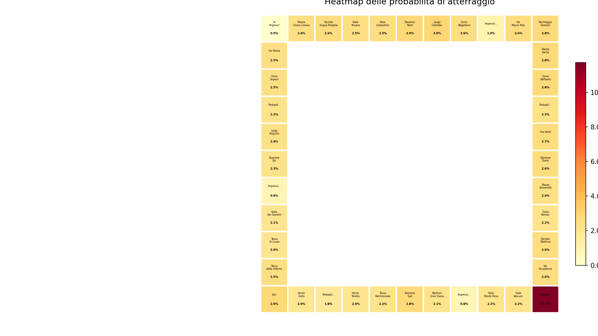
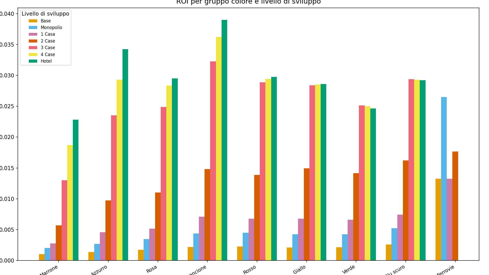
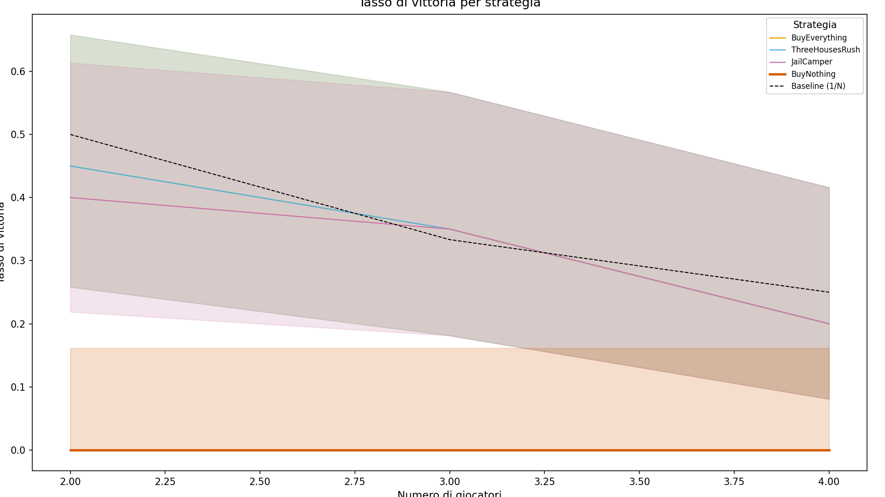
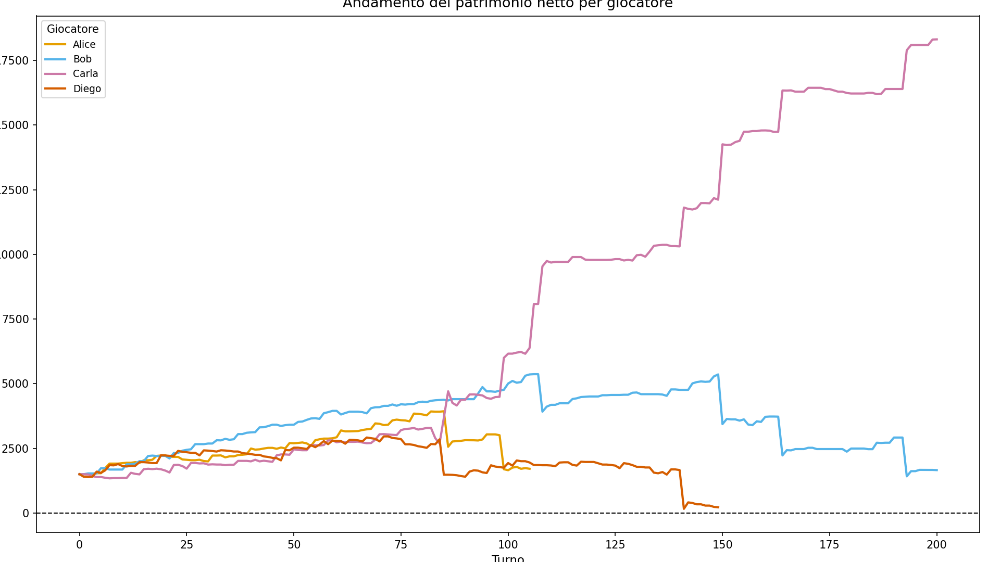

# Monopoly — Quantitative Strategy Analysis

A Monte Carlo and Markov chain study of the board game Monopoly. This project answers two questions with math instead of intuition:

1. **Which squares do players actually land on most often?**
2. **Which playing strategy wins the most games?**

  



*Stationary visit probability for each square of the standard board. Jail is the single most-visited square at ≈5.89%, followed by the orange color group — which drives the ROI results below.*

---

## Key Results

### 1. Square visit frequencies (Markov chain)

The board is modeled as an absorbing Markov chain that accounts for 2d6 dice rolls, doubles, the 3-doubles-to-jail rule, Chance/Community Chest movement cards, and the "Go to Jail" square. The stationary distribution identifies which squares generate the most rent events over a long game.


### 2. ROI by color group

Return on investment across color groups and house counts, computed from visit frequency × rent schedule − (price + house cost). The orange group dominates at 0–2 houses; dark blue peaks at 3 houses; light blue is the best value with hotels.



### 3. Win rate vs. opponent count

Monte Carlo win rates for each registered strategy across games with 2, 3, 4, 5, and 6 players. The `ThreeHousesRush` strategy — which stops building at three houses to exploit the housing-shortage rule — consistently outperforms greedy buying.



### 4. Sample game net-worth trajectory

A single seeded game replayed turn-by-turn, showing how each player's net worth evolves until one player bankrupts the others.



### 5. Game animation

A full sample game rendered as a short video.

[▶ `figures/game_animation.mp4`](figures/game_animation.mp4)

---

## Features

- **Rule-accurate game engine** — dice, doubles, jail, mortgages, houses/hotels, Chance & Community Chest decks, bankruptcy settlement.
- **7 strategies** — from trivial (`BuyNothing`) to rational (`Trader`) — all behind a clean `Strategy` interface.
- **Markov analysis** — build the transition matrix, solve for the stationary distribution, rank squares.
- **Monte Carlo simulator** — vectorized multi-game runs with seedable RNG.
- **Round-robin tournament** with Bradley-Terry / Elo ranking and confidence intervals.
- **Ablation tooling** for parameter sensitivity studies (cash reserves, build thresholds, jail timing).
- **Typer CLI** — five commands that each do one thing well.
- **Plotting + video export** — publication-ready matplotlib/seaborn figures and MP4/GIF animations.
- **38 test suites** covering rules, strategies, analysis, and CLI.

---

## Installation

**With conda** (recommended — matches the dev environment):

```bash
conda env create -f environment.yml
conda activate monopoly
pip install -e .
```

**With pip only**:

```bash
pip install -e .
```

Python ≥ 3.12 is required.

---

## Quick Start

The `monopoly` CLI exposes five commands:

```bash
# 1. Run a Monte Carlo simulation
monopoly simulate --n-games 1000 --players 4 --strategy BuyEverything --seed 42

# 2. Markov stationary distribution — top 10 most visited squares
monopoly markov --top 10

# 3. Round-robin strategy tournament
monopoly tournament --n-games 100 --seed 42

# 4. Generate a figure (heatmap | roi | win-rate | net-worth)
monopoly plot heatmap --output figures/heatmap.png --seed 42

# 5. Export a sample game animation
monopoly export-video --output figures/game.mp4 --fps 5 --seed 42
```

Each command is a thin orchestrator over the underlying API in `src/monopoly/`, so anything the CLI does is also callable from Python.

---

## Reproducing the Figures

All figures in this README are produced by the narrative script:

```bash
MONOPOLY_SEED=42 MONOPOLY_N_GAMES=10000 python scripts/come_vincere_al_monopoli.py
```

Or via the Makefile:

```bash
make video-assets
```

Both approaches write into `figures/`.

---

## Project Structure

```
monopoly/
├── src/monopoly/
│   ├── game.py, turn.py, state.py         # Game loop & state
│   ├── board.py, dice.py                  # Board model & dice
│   ├── cards.py, card_effects.py          # Chance / Community Chest
│   ├── jail.py, buildings.py, mortgage.py # Mechanics
│   ├── rent.py, purchase.py, effects.py   # Transactions
│   ├── bankruptcy.py                      # Bankruptcy settlement
│   ├── markov.py                          # Transition matrix + stationary
│   ├── simulate.py                        # Monte Carlo engine
│   ├── tournament.py, ranking.py          # Round-robin + Elo
│   ├── metrics.py, ablation.py            # ROI, win rates, sensitivity
│   ├── plots.py                           # Matplotlib/seaborn figures
│   ├── cli.py                             # Typer entry point
│   └── strategies/                        # 7 strategies behind a Strategy ABC
├── tests/                                 # 38 pytest suites
├── data/                                  # YAML board & card definitions
├── figures/                               # Committed PNG + MP4 outputs
├── scripts/come_vincere_al_monopoli.py    # End-to-end figure pipeline
├── docs/video_script.md                   # Italian video narrative
├── pyproject.toml, environment.yml, Makefile
└── README.md, LICENSE
```

---

## Strategies

| Strategy          | One-line description                                              |
|-------------------|-------------------------------------------------------------------|
| `BuyEverything`   | Buy every unowned property the player lands on.                   |
| `BuyNothing`      | Never buy properties — baseline control.                          |
| `ColorTargeted`   | Only buy properties in pre-selected color groups (default: orange). |
| `ThreeHousesRush` | Buy aggressively, build up to three houses per property, then stop. |
| `JailCamper`      | Stay in jail during the late game to avoid high-rent squares.     |
| `Trader`          | Propose and evaluate trades using a rational utility model.       |

All strategies subclass `monopoly.strategies.base.Strategy` and are registered in `monopoly.simulate.STRATEGY_REGISTRY`.

---

## Testing

```bash
# Full suite
pytest

# Skip slow statistical / Monte Carlo tests
pytest -m "not slow"

# With coverage
pytest --cov=monopoly --cov-report=term-missing
```

---

## Documentation

- **[docs/video_script.md](docs/video_script.md)** — Italian narrative script that walks through the methodology and results for a companion video (10–15 min).

---

## License

Released under the [MIT License](LICENSE).

**MONOPOLY** is a trademark of Hasbro, Inc. This project is an independent educational and research work, not affiliated with or endorsed by Hasbro. No Hasbro artwork or proprietary assets are used; the YAML board definitions in `data/` encode only the public-domain rule structure of the game for the purposes of quantitative analysis.
